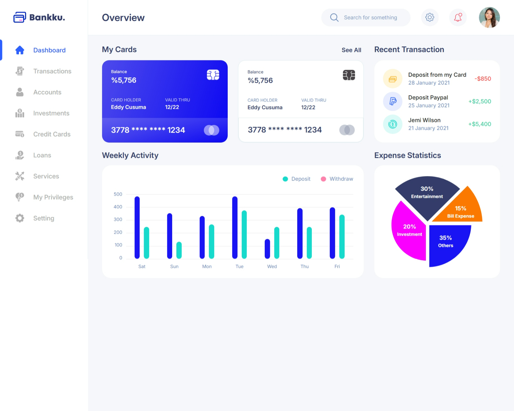
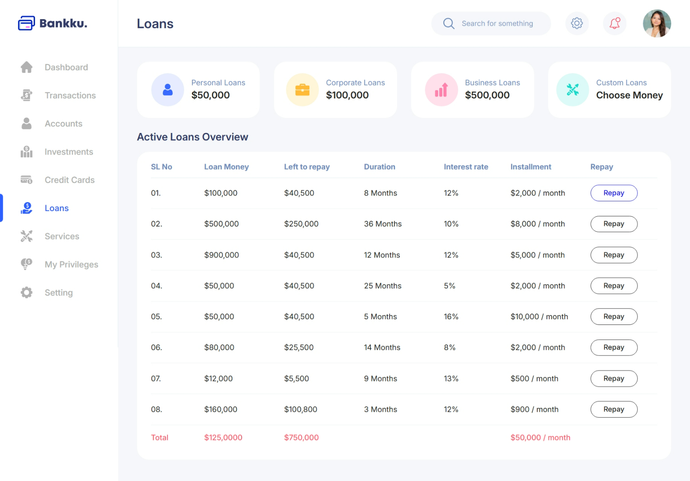
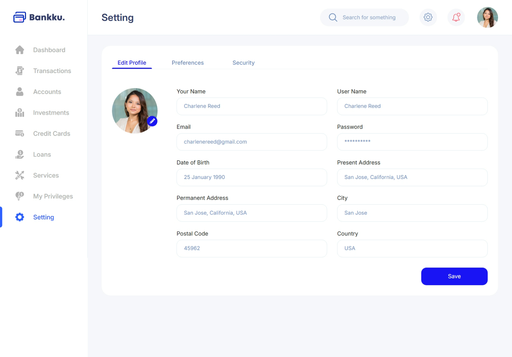
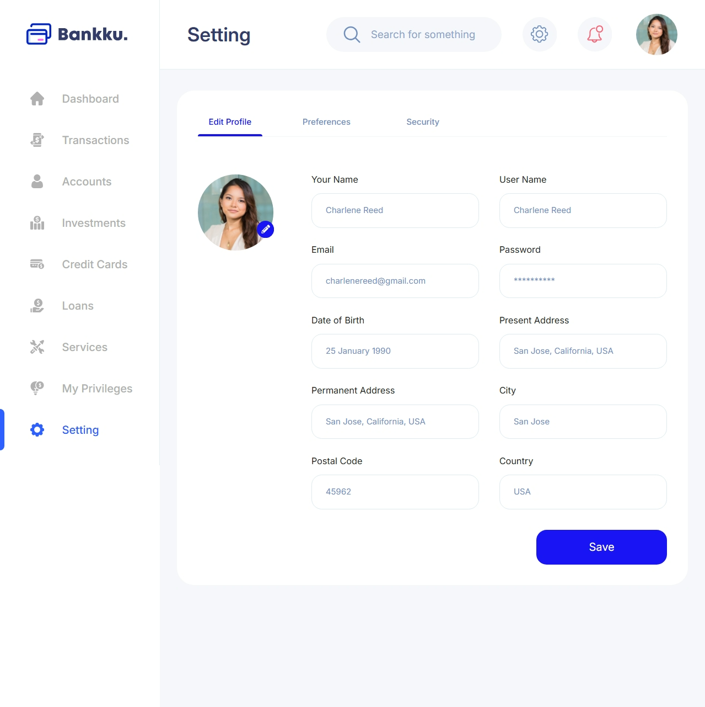
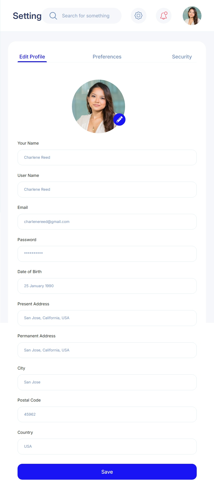
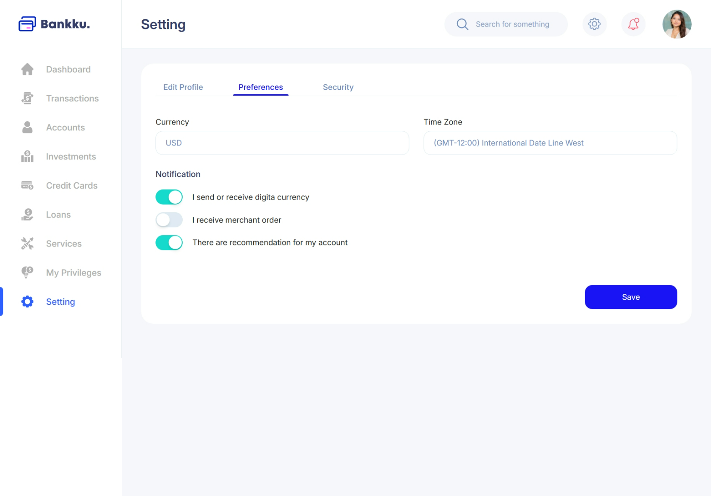
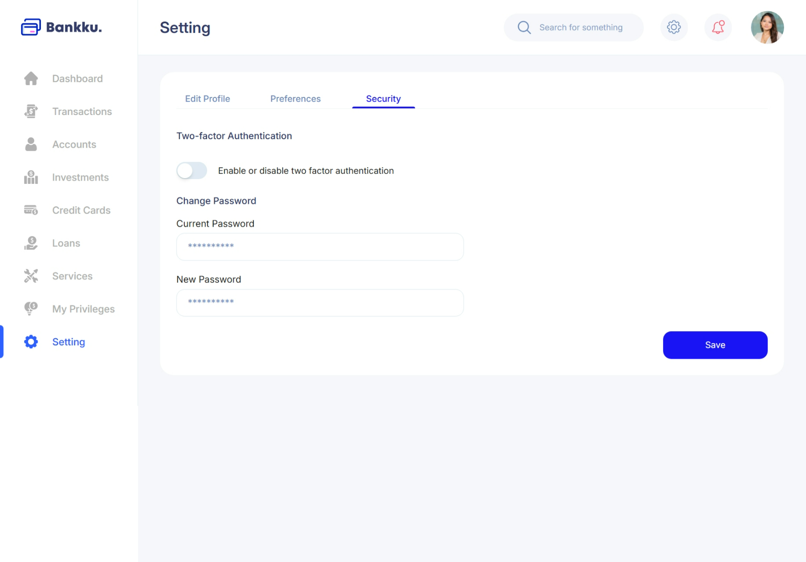

## 🚀 Web Dashboard - Frontend Developer Internship Test

### 📋 Deskripsi

Proyek ini adalah implementasi web dashboard berdasarkan desain Figma sebagai bagian dari tes magang untuk posisi Frontend Developer. Proyek dibangun menggunakan **Vue 3 + TypeScript + Vite + Tailwind CSS**.

### 🔗 Link Demo

💻 Vercel: https://test-inagata.vercel.app/

### 🛠️ Teknologi yang Digunakan

- HTML5, CSS3, TypeScript
- Vue.js, Tailwind CSS
- Vite
- Vercel

### 📱 Fitur dan Kriteria

- ✅ Responsif untuk desktop, tablet, dan mobile (hanya di halaman Setting)
- ✅ Konsisten dengan desain Figma (warna, font, layout)
- ✅ Struktur kode rapi dan mudah dibaca

### 🧾 Cara Menjalankan Proyek Lokal

```
# 1. Clone repository
git clone https://github.com/username/repo-name.git

# 2. Masuk ke folder proyek
cd repo-name

# 3. Install dependencies
npm install

# 4. Jalankan project
npm run dev
```

### 📝 Catatan

- Semua aset (gambar, ikon, font) diambil dari Figma.
- Tidak menggunakan template pihak ketiga — seluruh kode ditulis manual.
- Halaman dioptimalkan untuk performa dan aksesibilitas dasar.

## 🖼️ Preview Tampilan

| Destop                                         | Tab                                         | Mobile                                         |
| ---------------------------------------------- | ------------------------------------------- | ---------------------------------------------- |
|            | -                                           | -                                              |
|                 | -                                           | -                                              |
|         |  |  |
|  | -                                           | -                                              |
|     | -                                           | -                                              |
